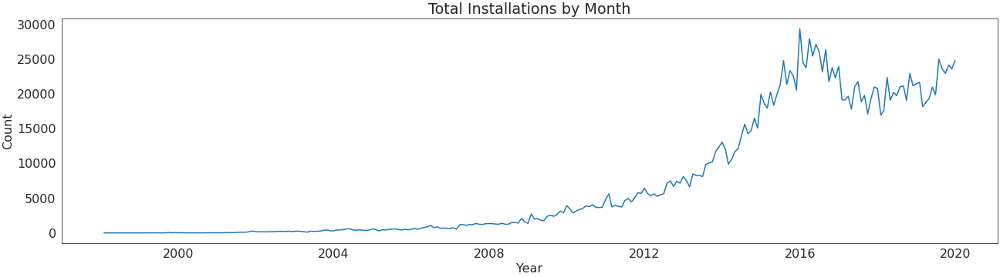
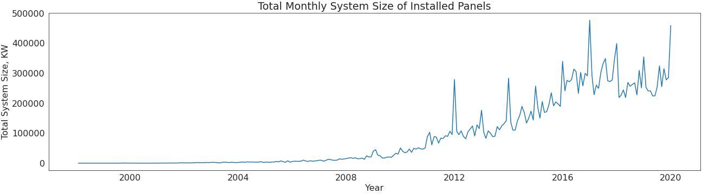
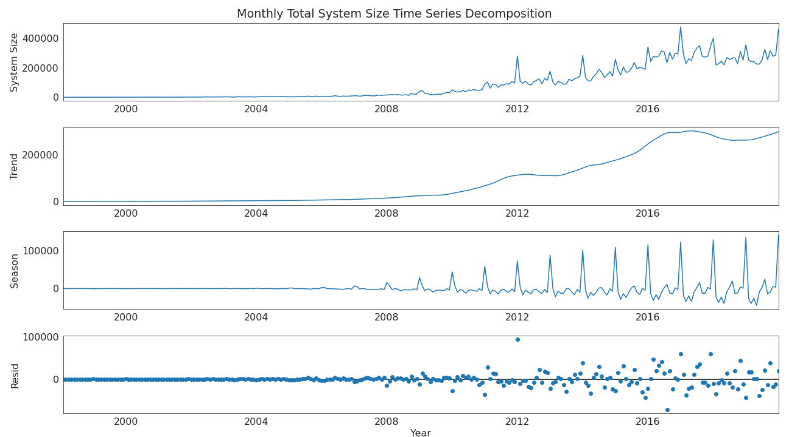
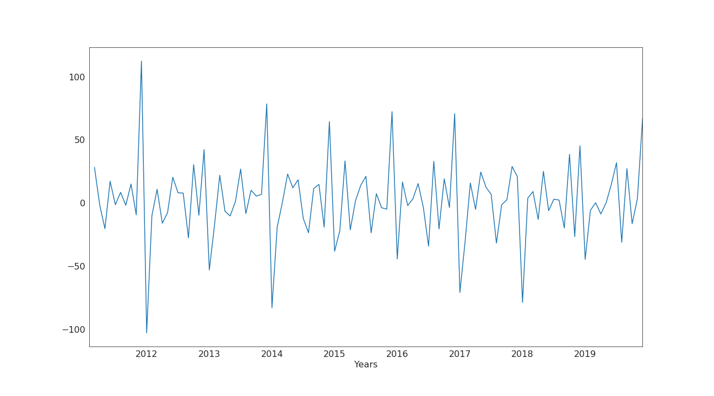
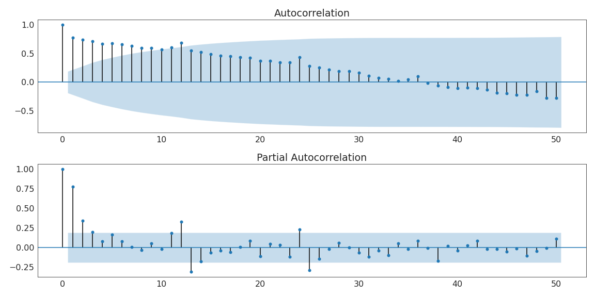
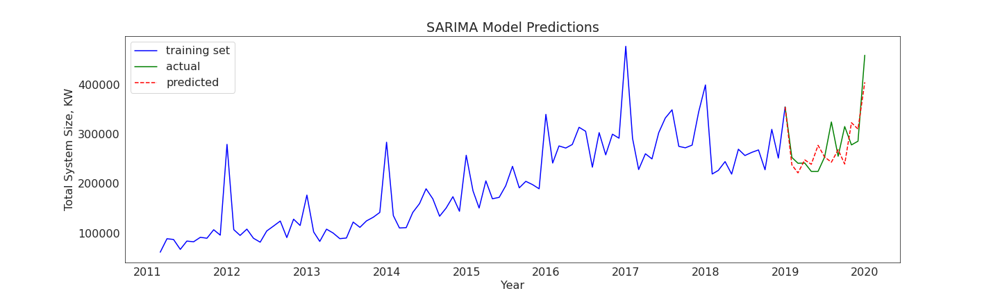
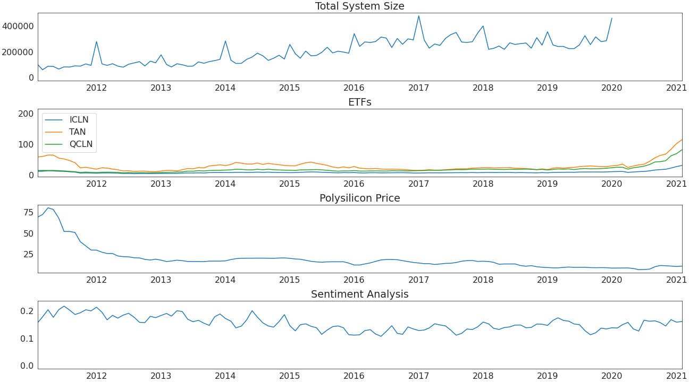

# Predicting Solar Panel Installation Number
Alternative energy is on the rise, and I'm particularly interested in the growth of the solar energy sector. This project predicts the number of solar panel output in the US , based on factors that include silicone price, sentiment analysis, and changes in economic conditions. Two types of models were used for prediction: SARIMA and FB Prophet.

## Data
### Solar Panel Installation Data
Main data is taken from Berkeley Lab [Tracking the Sun Report](https://emp.lbl.gov/tracking-the-sun), where csv files has solar panel installation data for 1998-2019 year across the  states. It is collected from US government agencies. There are total 1844487 rows and 78 columns. 
Null values were give as -9999, those points were cleaned up, when data was imported. Some unrealistic values for system size were also removed. 

### ETFS
Three ETFs were also used in FB Prophet model. Data was extracted using yfinance library. ETF ticker are the following:
ICLN
TAN
QCLN

### Polysilicon Price
Data was web scarped from pricequote section of www.energytrend.com. 

### Solar Energy related sentiment Analysis

Data was web scarped from solar news section of www.energytrend.com. 

### Clean up and transformations

### EDA

#### Monthly Installations Number

#### Monthly Total System Size for Installed Panels

One single installation record can either be small panel or larger installation with higher output. So monthly total system size was choosen for predictions, as it better reflects volume of monthly installations.

### Monthly Total System Size Time Series Decomposition

Yearly seasonality is observed. Also there is general upward trend, there was reduction around 2017-2018. 

### SARIMA model

Data from 2011 was used for modelling.  
Since Time series has seasonal component SARIMAX model was used. Box-Cox transformation was performed on System Size Time Series. 

Differencing was used to make data stationary .Difference Plot for transformed data is below. 

Autocorrelation and Partial Autocorrelation on transformed data plot was used to determine order and seasonal order parameters for SARIMAX model. 

order=(2,1,0), seasonal_order=(2,1,0,12) was used in SARIMAX model. 

SARIMA model prediction and actual plots

 

RMSE for sarima model is 42,606.6 KW

### FB prophet model

Used time series for analysis

 

RMSE for sarima model is 31,729.4 KW
